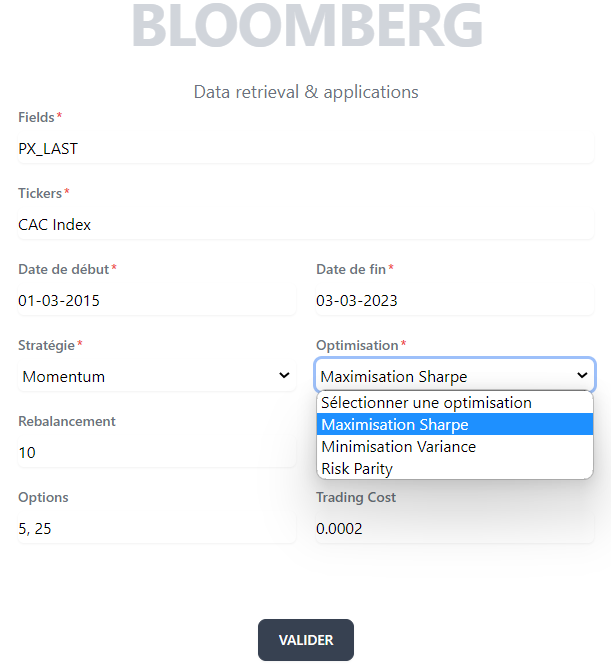

## Requirements

- [Python](https://www.python.org/downloads/) : Download and install
- [Node.js](https://nodejs.org/en) : Download and install
- [PNPM](https://pnpm.io/fr/installation) : Download pnpm

## Getting Started

First, install pip packages and node packages

At the root of the project (install all the python packages, defined in the requirements.txt):

```bash
pip install -r requirements.txt
```

At the root of the project (install all the node packages, defined in the package.json):

```bash
pnpm install
```

Then, run the development server:

```bash
pnpm run dev
```

Open [http://localhost:3000](http://localhost:3000) with your browser to see the result.

## How to use

For the "fields", "tickers" and "options" inputs, you need to separate values by `", "` (a coma and a space) as in the example :

Fields : _PX_LAST, INDX_MWEIGHT_HIST_

Options : _5, 25_



Then, validate and wait until the loader is gone.

## References

To learn more about our project, take a look at the following resources that help us to build the front of the project and the link with our python code base:

- [Next.js Documentation](https://nextjs.org/docs) - learn about Next.js features and API.
- [PNPM Documentation](https://pnpm.io/) - an interactive Next.js tutorial.
- [Chart.js Documentation](https://react-chartjs-2.js.org/) - to construct the charts in the HTML page
- [Python Shell Node Documentation](https://www.npmjs.com/package/python-shell) - to execute python code to javascript and pass arguments
